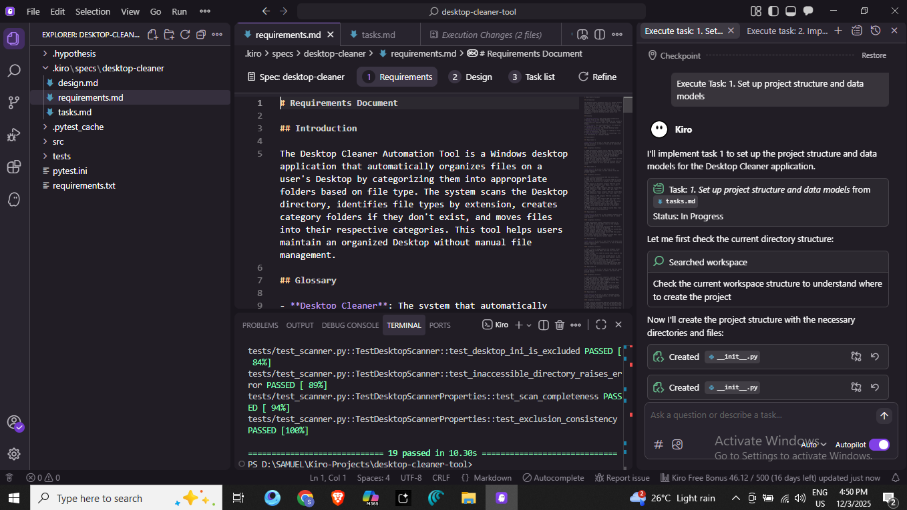
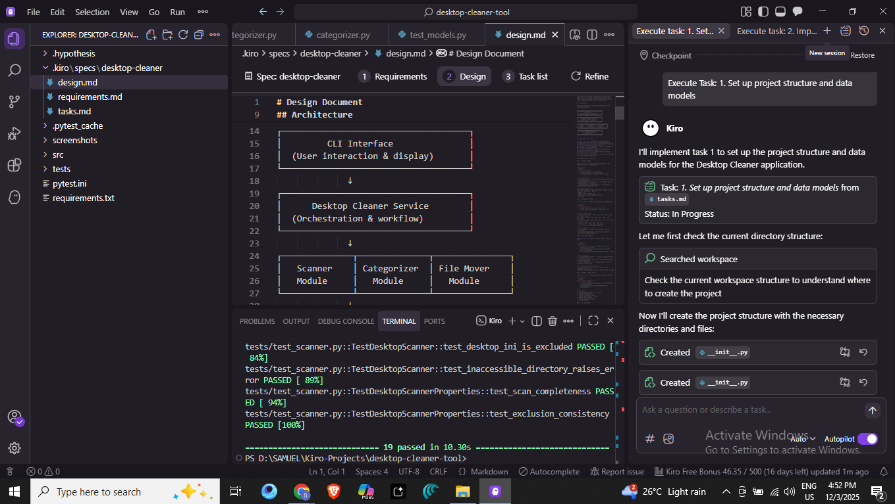
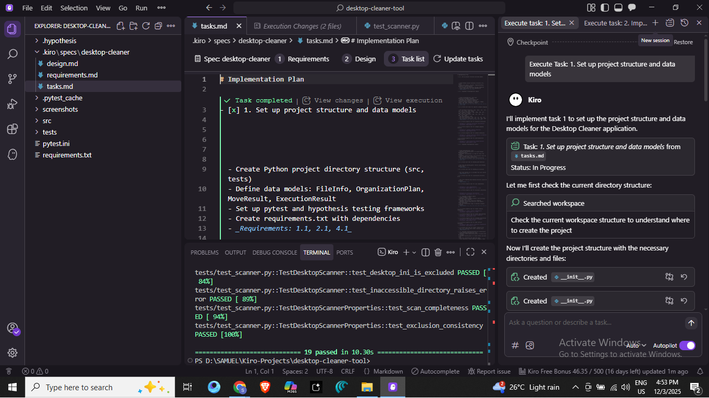
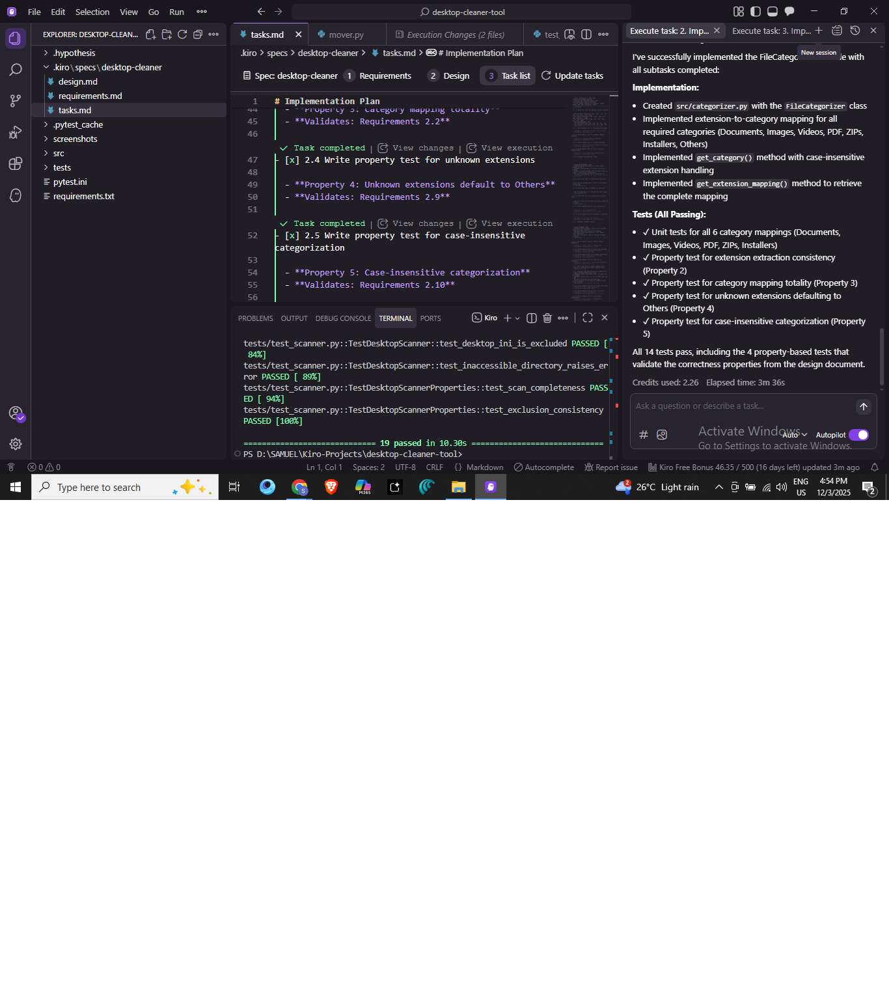
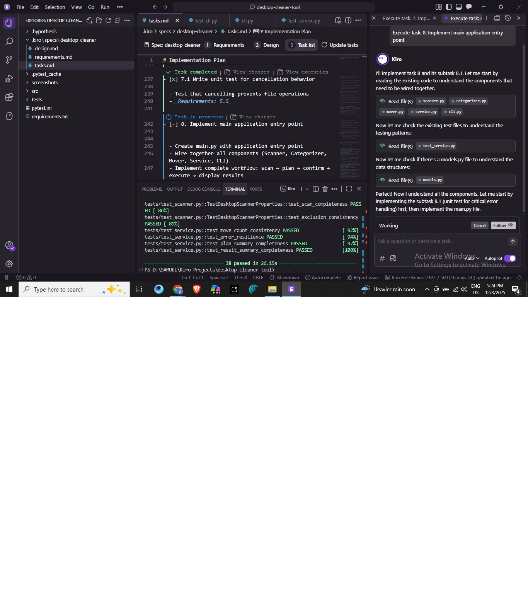

# Desktop Cleaner Automation Tool 🗂️

A Python-based command-line tool that automatically organizes files on your Windows Desktop by categorizing them into appropriate folders based on file type. Built using spec-driven development with Kiro AI.



## 📋 Table of Contents

- [Overview](#overview)
- [Features](#features)
- [Project Structure](#project-structure)
- [Installation](#installation)
- [Usage](#usage)
- [Testing](#testing)
- [Development with Kiro](#development-with-kiro)
- [Screenshots](#screenshots)
- [Acknowledgments](#acknowledgments)

## 🎯 Overview

The Desktop Cleaner Automation Tool helps you maintain an organized Desktop without manual file management. It scans your Desktop directory, identifies file types by extension, creates category folders if they don't exist, and moves files into their respective categories with user confirmation.

**Key Benefits:**
- ✅ Automatic file categorization based on extensions
- ✅ Safe operation with user confirmation before changes
- ✅ Intelligent name conflict resolution
- ✅ Error resilience - continues processing even if some files fail
- ✅ Comprehensive test coverage with property-based testing

## ✨ Features

### File Categorization

Files are automatically categorized into the following folders:

| Category | File Extensions |
|----------|----------------|
| **Documents** | .doc, .docx, .txt, .rtf, .odt, .xls, .xlsx, .ppt, .pptx |
| **Images** | .jpg, .jpeg, .png, .gif, .bmp, .svg, .ico, .webp |
| **Videos** | .mp4, .avi, .mkv, .mov, .wmv, .flv, .webm |
| **PDF** | .pdf |
| **ZIPs** | .zip, .rar, .7z, .tar, .gz |
| **Installers** | .exe, .msi, .dmg, .pkg |
| **Others** | All other file types |

### Smart Features

- **Case-Insensitive**: Handles extensions regardless of case (.PDF, .pdf, .Pdf)
- **Name Conflict Resolution**: Automatically appends numeric suffixes (file_1.pdf, file_2.pdf)
- **Exclusion Rules**: Skips folders, hidden files, system files (desktop.ini)
- **Error Handling**: Logs errors and continues processing remaining files
- **Dry-Run Preview**: Shows what will happen before making any changes

## 📁 Project Structure

```
desktop-cleaner-tool/
├── .kiro/
│   └── specs/
│       └── desktop-cleaner/
│           ├── requirements.md      # EARS-compliant requirements
│           ├── design.md           # Architecture and design
│           └── tasks.md            # Implementation plan
├── src/
│   ├── __init__.py
│   ├── models.py                   # Data models
│   ├── scanner.py                  # Desktop scanning module
│   ├── categorizer.py              # File categorization logic
│   ├── mover.py                    # File moving operations
│   ├── service.py                  # Orchestration service
│   └── cli.py                      # Command-line interface
├── tests/
│   ├── test_models.py
│   ├── test_scanner.py
│   ├── test_categorizer.py
│   ├── test_mover.py
│   ├── test_service.py
│   ├── test_cli.py
│   ├── test_main.py
│   └── test_integration.py         # End-to-end tests
├── screenshots/                     # Documentation images
├── main.py                         # Application entry point
├── requirements.txt                # Python dependencies
├── pytest.ini                      # Test configuration
└── README.md                       # This file
```

## 🚀 Installation

### Prerequisites

- Python 3.8 or higher
- Windows 10/11 (primary target platform)

### Steps

1. **Clone the repository**
   ```bash
   git clone https://github.com/yourusername/desktop-cleaner-tool.git
   cd desktop-cleaner-tool
   ```

2. **Create a virtual environment** (recommended)
   ```bash
   python -m venv venv
   venv\Scripts\activate  # On Windows
   ```

3. **Install dependencies**
   ```bash
   pip install -r requirements.txt
   ```

## 💻 Usage

### Running the Tool

Simply run the main script:

```bash
python main.py
```

### Workflow

1. **Scan**: The tool scans your Desktop directory
2. **Plan**: Creates an organization plan showing files per category
3. **Confirm**: Displays the plan and asks for confirmation
4. **Execute**: Moves files to category folders (only if confirmed)
5. **Results**: Shows summary with statistics and any errors

### Example Output

```
Scanning Desktop directory...
Found 15 file(s) to organize.

Creating organization plan...

=== Organization Plan ===

Files to organize:
  Documents: 5 file(s)
  Images: 7 file(s)
  PDF: 2 file(s)
  Others: 1 file(s)

Folders to create:
  - Documents
  - Images
  - PDF
  - Others

Do you want to proceed? (yes/no): yes

Organizing files...

=== Organization Complete ===

Total files moved: 15
Duration: 0.45 seconds

Files moved by category:
  Documents: 5
  Images: 7
  PDF: 2
  Others: 1

No errors encountered.
```

## 🧪 Testing

The project uses a comprehensive testing strategy combining unit tests and property-based tests.

### Running All Tests

```bash
pytest
```

### Running Specific Test Files

```bash
pytest tests/test_categorizer.py
pytest tests/test_scanner.py
pytest tests/test_integration.py
```

### Running with Verbose Output

```bash
pytest -v
```

### Test Coverage

The project includes 49 tests covering:

- **Unit Tests**: Specific functionality and edge cases
- **Property-Based Tests**: Universal properties using Hypothesis
- **Integration Tests**: End-to-end workflows

**Property-Based Testing** validates correctness properties such as:
- Scan completeness
- Extension extraction consistency
- Category mapping totality
- Folder creation idempotence
- Name conflict resolution uniqueness
- Error resilience
- And more...

## 🤖 Development with Kiro

This project was built using **Kiro AI's spec-driven development workflow**, which follows a structured approach to software development:

### Kiro Workflow


*Step 1: Requirements gathering using EARS (Easy Approach to Requirements Syntax)*


*Step 2: Design document with architecture and correctness properties*


*Step 3: Implementation plan with actionable tasks*


*Step 4: Incremental task execution*

### The Spec-Driven Process

1. **Requirements** (`.kiro/specs/desktop-cleaner/requirements.md`)
   - User stories with acceptance criteria
   - EARS-compliant requirements
   - INCOSE quality standards

2. **Design** (`.kiro/specs/desktop-cleaner/design.md`)
   - System architecture
   - Component interfaces
   - **Correctness properties** for property-based testing
   - Error handling strategy

3. **Tasks** (`.kiro/specs/desktop-cleaner/tasks.md`)
   - Incremental implementation plan
   - Property-based test tasks
   - Checkpoints for validation

4. **Implementation**
   - Execute tasks one at a time
   - Write code and tests together
   - Validate with property-based testing

### Why Spec-Driven Development?

- **Clarity**: Clear requirements before coding
- **Correctness**: Formal properties ensure software behaves correctly
- **Testability**: Properties become executable tests
- **Maintainability**: Documentation stays in sync with code
- **Confidence**: Comprehensive test coverage from the start

### Correctness Properties

The design document defines 14 correctness properties that the system must satisfy. These properties are implemented as property-based tests using Hypothesis, which generates hundreds of random test cases to verify each property holds universally.

Example properties:
- *For any* directory with files, scanning returns exactly those files
- *For any* file extension, categorization is case-insensitive
- *For any* file moved with naming conflicts, a unique name is generated
- *For any* set of files with some failures, the system continues processing

## 📸 Screenshots

### Requirements Document


### Design Document


### Task List


### Task Execution




## 🙏 Acknowledgments

- **Kiro AI** - For the spec-driven development workflow and AI-assisted implementation
- **Hypothesis** - For property-based testing framework
- **pytest** - For the testing infrastructure

## 📄 License

This project is open source and available under the MIT License.

## 🤝 Contributing

Contributions are welcome! Please feel free to submit a Pull Request.

1. Fork the repository
2. Create your feature branch (`git checkout -b feature/AmazingFeature`)
3. Commit your changes (`git commit -m 'Add some AmazingFeature'`)
4. Push to the branch (`git push origin feature/AmazingFeature`)
5. Open a Pull Request

## 📧 Contact

For questions or feedback, please open an issue on GitHub.

---

**Built with ❤️ using Kiro AI's spec-driven development workflow**
